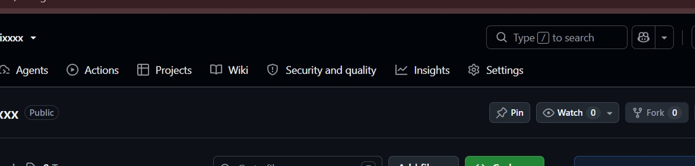

 

# おはよう！ I'm Vynara 🌸

**Student · Developer · Dreamer · Star-gazer**

*Code ✦ Learn ✦ Build ✦ Explore*

---

### 🌷 About me

Hi! I'm **Vinaya**, a BE Computer Science and Engineering student specializing in Data Science. I enjoy exploring AI, data science, cybersecurity, and creative software development.

- 🧠 Exploring machine learning, data analytics, and intelligent systems
- 🛡️ Interested in cybersecurity and privacy-aware design
- 💻 Building dashboards, web apps, and developer tools
- 🌸 Outside code: anime, games, drawing, stargazing, and Japanese-inspired design

---

### 🧰 Tools I use

---

### ✨ Featured projects

<table>
<tr>
<td width="50%" valign="top">

**🖥️ Neural-OS**

Realtime system observability with anomaly detection and an interactive dashboard.

`Python` `Flask` `Socket.IO` `ML`

</td>
<td width="50%" valign="top">

**🛡️ SecureNet**

Cyber-defence research exploring AI-assisted monitoring and security concepts.

`Python` `Cybersecurity` `Blockchain`

</td>
</tr>
<tr>
<td width="50%" valign="top">

**📦 StockSense**

Inventory management for products, stock movements, and warehouse operations.

`React` `TypeScript` `PostgreSQL`

</td>
<td width="50%" valign="top">

**🐰 CelesteVeil**

A kawaii-inspired local AI companion concept.

`Python` `Ollama` `UI`

</td>
</tr>
</table>

[**Explore all my repositories →**](https://github.com/RisingPhoeinixxxx?tab=repositories)

---

### 📊 GitHub activity

Statistics and technology icons are provided by external services and may occasionally be unavailable or cached.

---

### またね！ 🌸

*Keep learning, keep building, and be kind.*

