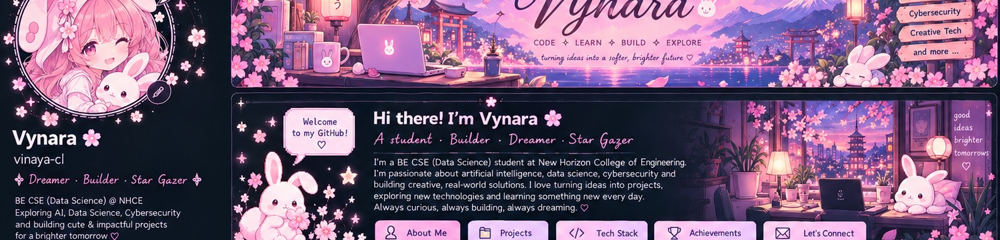
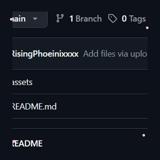
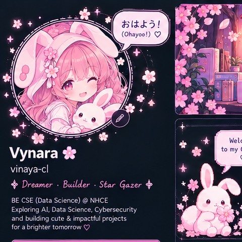

 

# 🌸 おはよう！ Ohayō! I'm Vynara 🐰

### `CODE` ✧ `LEARN` ✧ `BUILD` ✧ `EXPLORE`

*夢をコードに — Turning dreams into code.*

---

<table>
<tr>
<td width="32%" valign="top" align="center">

### 🌷 A little about me

**Student · Builder · Dreamer · Star-gazer**

🎓 BE CSE (Data Science)  
🧠 AI & Machine Learning  
🛡️ Cybersecurity  
🎨 Creative technology  
🌙 Always learning

*今はまだ勉強中 — Still learning.*

</td>
<td valign="top">

## ✨ Welcome to my little corner of GitHub!

I'm a Computer Science and Data Science student who loves exploring the intersection of **AI, data, cybersecurity, and creative software**.

I enjoy turning curious ideas into practical projects—from intelligent monitoring and security concepts to useful web apps and cozy local-AI experiences. I learn by experimenting, documenting what I discover, and building things that are useful and delightful.

- 🔭 **Exploring:** machine learning, intelligent systems, cybersecurity, and full-stack development
- 🧪 **Building:** research prototypes, dashboards, and creative developer tools
- 🌱 **Learning:** secure system design, responsible AI, and stronger software engineering
- 🎀 **Creative side:** UI design, anime, games, drawing, and Japanese-inspired aesthetics

</td>
</tr>
</table>

---

## 🌸 What I love working on

<table>
<tr>
<td width="33%" valign="top">

### 🧠 AI & Data Science
Machine learning, data analysis, anomaly detection, and intelligent systems that turn information into useful insights.

</td>
<td width="33%" valign="top">

### 🛡️ Cybersecurity
Defensive security, threat analysis, privacy-aware systems, and secure application design.

</td>
<td width="33%" valign="top">

### 💻 Software Development
Web apps, dashboards, automation tools, and interactive experiences with thoughtful UX.

</td>
</tr>
<tr>
<td width="33%" valign="top">

### 🔬 Research & Innovation
Exploring ideas across AI, databases, security, and emerging computing technologies.

</td>
<td width="33%" valign="top">

### 🎨 Creative Technology
Mixing thoughtful UX, delightful visuals, and code to make tools practical and fun.

</td>
<td width="33%" valign="top">

### 🌏 Lifelong Learning
Learning new tools, joining hackathons, collaborating, and growing one project at a time.

</td>
</tr>
</table>

---

## 🧰 Tech toolbox

---

## 🎐 Featured projects

<table>
<tr>
<td width="50%" valign="top">

### 🖥️ Neural-OS
**Realtime AI-powered system observability**

A monitoring platform combining live system metrics, anomaly detection, and an interactive dashboard.

`Python` `Flask` `Socket.IO` `Machine Learning`

[Browse repositories →](https://github.com/RisingPhoeinixxxx?tab=repositories)

</td>
<td width="50%" valign="top">

### 🛡️ SecureNet
**Adaptive cyber-defence research**

A security-focused architecture exploring AI-assisted monitoring, deception concepts, and tamper-evident event logging.

`Python` `Cybersecurity` `Security Research`

[Browse repositories →](https://github.com/RisingPhoeinixxxx?tab=repositories)

</td>
</tr>
<tr>
<td width="50%" valign="top">

### 📦 StockSense
**Inventory management system**

A centralized inventory app for products, stock movements, warehouse operations, and user-specific data.

`React` `TypeScript` `PostgreSQL` `Supabase`

[Browse repositories →](https://github.com/RisingPhoeinixxxx?tab=repositories)

</td>
<td width="50%" valign="top">

### 🐰 CelesteVeil
**A cozy local-AI companion concept**

A kawaii-inspired assistant experience exploring local language models and a gentle, playful interface.

`Python` `Ollama` `Frontend`

[Browse repositories →](https://github.com/RisingPhoeinixxxx?tab=repositories)

</td>
</tr>
<tr>
<td width="50%" valign="top">

### 🎧 Auto English Subtitle Generator
**Local subtitle workflow**

A tool for generating subtitle files from video audio using speech recognition and local processing.

`Python` `Whisper` `FFmpeg`

</td>
<td width="50%" valign="top">

### 🌱 More experiments
I also explore database systems, data analysis, developer utilities, and creative AI experiences.

[Browse all repositories →](https://github.com/RisingPhoeinixxxx?tab=repositories)

</td>
</tr>
</table>

> 🌱 These are short project summaries. Visit the repositories for implementation details and current project status.

---

## 📊 My GitHub garden

Stats are supplied by third-party services and may be cached or temporarily unavailable. They are not second-by-second live. Language cards reflect code in public repositories, not overall ability.

---

## 🏮 Little milestones

📚 Learning through coursework and hands-on experiments · 📝 Exploring research and technical writing · 🤝 Joining hackathons and collaborative builds · 🧩 Turning experiments into documented projects

## 💌 Let's connect

If you're interested in AI, data science, cybersecurity, or creative coding, let's learn and build together!

### 🌸 今日もいい日になりますように！

*Kyō mo ii hi ni narimasu yō ni — May today be a good day, too.*

**まだまだ勉強中… Still learning. Still dreaming. Still building. ♡**

